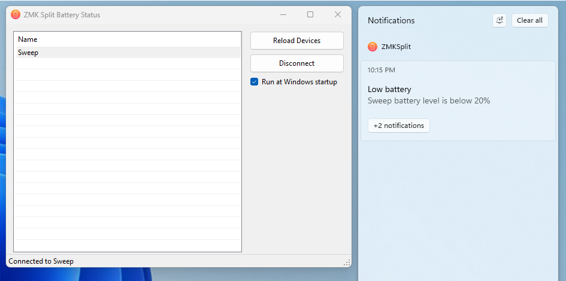
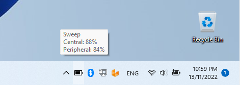
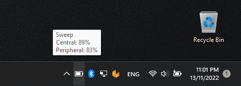

# ZMK Split Battery Status

This app shows bluetooth device battery status in tray area.

It was designed to support devices with two or more batteries which statuses are reported via BLE GATT Characteristics.

Once one of the batteries level falls below 20% a toast notification is shown.

Dark/Light taskbar themes supported.

Requirements:
- Windows 10.0.19041 and above.
- .NET Desktop Runtime 5.0

## Screenshots:

